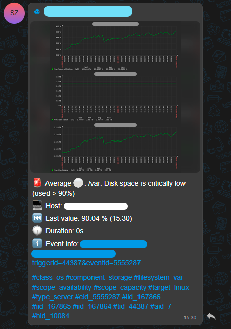

Скрипт алертов от Zabbix в eXpress. С графиками, читаемым видом и т.д.

### Использование:

- Кладем скрипт на сервер Zabbix, заполнив все переменные в файле .env:
  `/usr/lib/zabbix/alertscripts/zbxExpress.py`

- Делаем исполняемым:
  `sudo chmod +x /usr/lib/zabbix/alertscripts/zbxExpress.py`

- Если надо, ставим пакеты из requirements.txt:
  `python -m pip install -r requirements.txt`

- Импортирем шаблон медиа:
  В Alerts → Media Types → Import → zbx_export_mediatypes.json

- Включаем алерты User settings → Notifications → Add → Выбрать созданный тип → В поле Send to указать ID канала\группы\чата
